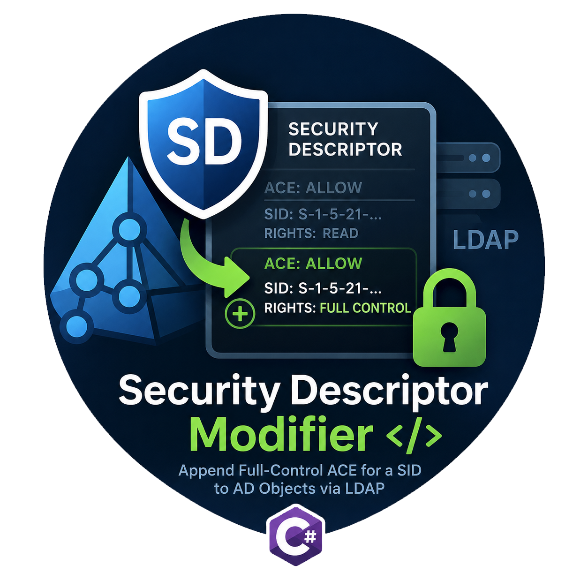

# sdmod — Modificateur de descripteur de sécurité

**Langues**: [English](../README.md) | [中文](README.zh-CN.md) | **Français**



Un outil CLI C# qui ajoute une ACE de contrôle total au descripteur de sécurité d'un objet AD via LDAP, conçu pour le red team et adapté à Sliver C2 `execute-assembly --in-process`.

  [](https://github.com/RedteamNotes/sdmod/releases/latest) [](../LICENSE) [](../SECURITY.md)

Orienté opérationnel : la liaison utilise `Secure | ServerBind` pour forcer une connexion directe au DC nommé — sans auto-sélection, afin que les écritures dans la partition de schéma atteignent de manière fiable le détenteur du rôle FSMO Schema Master. Le descripteur de sécurité est lu et écrit dans sa forme native de chaîne SDDL ; le DC analyse et convertit lui-même la modification — pas de conversion binaire SDDL, pas d'échec « serveur refusant le traitement ». L'ACE est ajoutée, jamais remplacée : toutes les ACE existantes (y compris les OA de type objet spécifiques au schéma, le propriétaire implicite et le groupe principal) sont préservées.

Implémenté uniquement avec `System.DirectoryServices`, compilé sur Mono en un assembly x64 d'environ 4-6 Ko sans dépendance tierce — petit, sans dépendance et facile à charger en mémoire. Destiné au red team autorisé, au test d'intrusion et aux environnements de laboratoire.

<br clear="right">

## Fonctionnalités

| Aspect | Description |
|---|---|
| Lecture | Récupère le descripteur de sécurité de l'objet cible sous forme de chaîne SDDL, en forçant un rafraîchissement du cache d'attributs pour utiliser la valeur la plus récente |
| Ajout | Ajoute une seule ACE de contrôle total (mêmes droits que Domain Admins) pour un SID donné — append-only, en préservant toutes les ACE existantes |
| Écriture | Valide directement la chaîne SDDL mise à jour ; le DC l'analyse et la convertit nativement, garantissant une compatibilité de format |
| Liaison | `Secure \| ServerBind` — signature LDAP plus liaison directe forcée au serveur nommé, contournant l'auto-sélection du DC |
| Zéro dépendance | Uniquement `System.DirectoryServices` ; compatible Mono, assembly x64 d'environ 4-6 Ko, aucune bibliothèque tierce |

## Compilation

Nécessite Mono (`mcs`) ou .NET Framework 4.x. Récupérez le fichier source, puis sur Debian / Kali installez les dépendances de compilation :

```bash
# Récupérer le fichier source (fichier unique)
curl -O https://raw.githubusercontent.com/RedteamNotes/sdmod/main/sdmod.cs

# Installer les dépendances de compilation (Debian / Kali)
sudo apt update
sudo apt install -y mono-mcs mono-devel

# Compilation
mcs sdmod.cs -out:sdmod.exe -r:System.DirectoryServices.dll -platform:x64 -debug-
```

Aucune dépendance tierce. Aucun binaire précompilé n'est fourni dans les releases — compilez-le vous-même avec la commande ci-dessus afin de minimiser l'exposition de la chaîne d'approvisionnement. À propos des options : `-platform:x64` force la cible x64 pour correspondre à l'architecture du beacon Sliver et `-debug-` évite le fichier de symboles .mdb. `-optimize` et `-nologo` n'ont qu'un effet négligeable sur un outil aussi petit — `-nologo` supprime simplement la bannière du compilateur et ne change rien à la sortie.

## Utilisation

```text
sdmod.exe <LDAP Path> <User> <Pass> <AttrName> <TrusteeSID>
```

### Arguments

| # | Argument | Description |
|---|---|---|
| 1 | `<LDAP Path>` | Chemin de l'objet LDAP, p. ex. `LDAP://dc.redteamnotes.local/CN=Group,CN=Schema,CN=Configuration,DC=redteamnotes,DC=local` |
| 2 | `<User>` | Utilisateur d'authentification, `domaine\utilisateur` |
| 3 | `<Pass>` | Mot de passe |
| 4 | `<AttrName>` | Attribut cible, p. ex. `defaultSecurityDescriptor` |
| 5 | `<TrusteeSID>` | SID se voyant accorder le contrôle total (SID passé directement — aucune résolution de nom) |

### Codes de sortie

| Code | Signification |
|---|---|
| 0 | Succès |
| 1 | Erreur d'utilisation / d'argument |
| 2 | Type d'attribut inattendu |
| 3 | Échec de l'opération LDAP / AD (détail sur stderr) |

## Exemples

Interroger d'abord la valeur actuelle, afin d'enregistrer le SDDL d'origine pour restauration :

```text
sliver > sa-ldapsearch -- -query "(name=Group)" -dn "CN=Schema,CN=Configuration,DC=redteamnotes,DC=local" -hostname dc.redteamnotes.local -attributes defaultSecurityDescriptor
```

Ajouter une ACE de contrôle total pour le SID cible :

```text
sliver > execute-assembly --in-process sdmod.exe -- \
  "LDAP://dc.redteamnotes.local/CN=Group,CN=Schema,CN=Configuration,DC=redteamnotes,DC=local" \
  "redteamnotes\redpen" "P@ssw0rd" "defaultSecurityDescriptor" "S-1-5-21-xxxxxxxxxx-xxxxxxxxxx-xxxxxxxxxx-xxxx"

[+] Success: ACE added successfully
```

Vérifier en relançant la requête — la nouvelle ACE apparaît à la fin de la chaîne SDDL.

Pour une procédure complète de bout en bout (avec un exemple complet), voir [TUTORIAL](TUTORIAL.fr.md).

## Remarques

- Prévoir environ 3 à 5 minutes après l'écriture avant que la modification prenne effet ; les tentatives précoces échouent.
- Cette opération modifie le `defaultSecurityDescriptor` de la partition de schéma (un modèle), pas l'appartenance à un groupe — les objets existants ne sont pas affectés ; les objets créés ensuite héritent de l'ACE.
- Enregistrer le SDDL d'origine avant toute modification afin de pouvoir la restaurer.
- Ré-exécuter l'outil ajoute à nouveau la même ACE (le SDDL accumule une ACE en double à chaque exécution). Restaurez la valeur d'origine enregistrée si nécessaire.
- Le mot de passe circule en clair sur la ligne de commande (visible dans les listes de processus / arguments `execute-assembly`). Acceptez cette exposition ou utilisez un contexte détenant déjà les informations d'identification.
- Destiné uniquement aux tests autorisés.

## Surface de détection

Ce que la modification représente du point de vue des défenseurs, et comment limiter les traces.

- Le `defaultSecurityDescriptor` modifié se réplique avec la partition de schéma ; interroger l'objet révèle l'ACE ajoutée et son SID codé en dur.
- L'écriture déclenche une modification d'attribut du service d'annuaire sur le DC qui la reçoit (Event 5136) si l'audit d'accès DS est activé.
- Comme aucune appartenance à un groupe n'est touchée, la surveillance habituelle des groupes privilégiés (Event 4728/4732) n'est pas déclenchée.

### Réduire vos traces

- Préférer la modification du modèle de schéma aux changements directs d'appartenance — aucun delta `Member`.
- Enregistrer et restaurer le SDDL d'origine à la fin de l'engagement.

## Utilisation via Sliver `execute-assembly`

Voie de déploiement principale — exécution en mémoire, aucun artefact sur disque :

```text
sliver > make-token -d redteamnotes.local -u redpen -p 'P@ssw0rd'
sliver > execute-assembly --in-process sdmod.exe -- ...
```

`make-token` utilise par défaut `LOGON32_LOGON_NEW_CREDENTIALS` : les actions locales s'exécutent avec l'identité du processus d'origine ; seules les connexions réseau sortantes portent les nouvelles informations d'identification.

## Licence

sdmod est publié sous licence MIT.

## Avertissement

Destiné uniquement aux évaluations de sécurité autorisées, aux CTF et aux environnements de laboratoire. L'auteur décline toute responsabilité en cas d'utilisation abusive.
